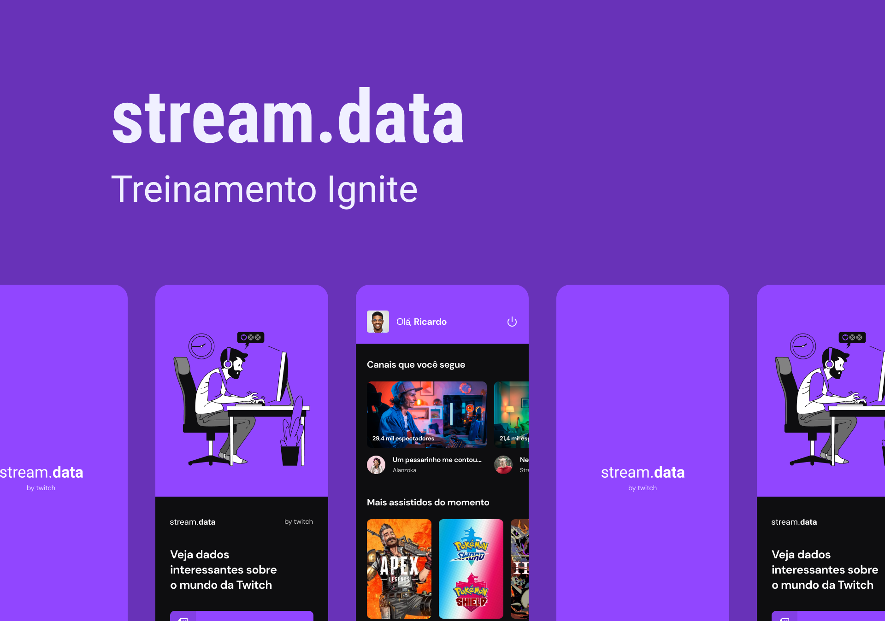
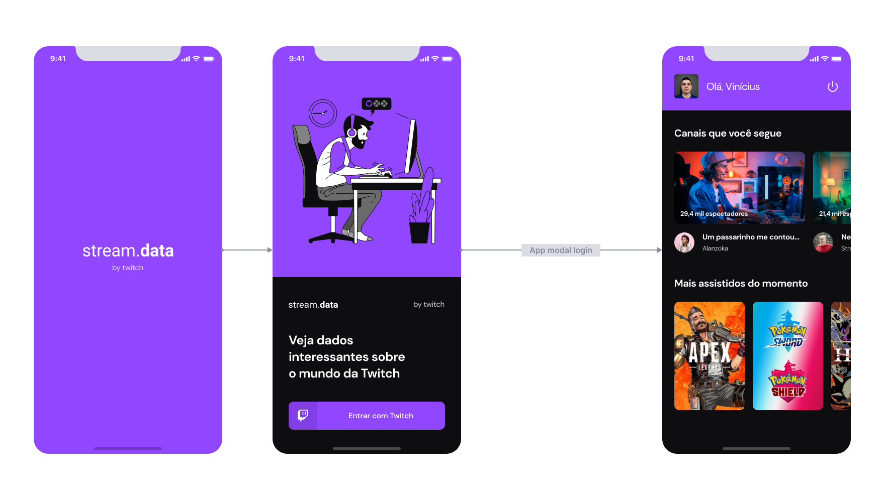

# streamdata
[](https://typescriptlang.org "Go to TypeScript homepage")
[](https://reactnative.dev "Go to React Native homepage")
[](#)
[](#)
[](https://github.com/axios/axios "Go to Axios GitHub")
[](https://styled-components.com/ "Go to Styled Components homepage")



## About the project

The app consists of a social login screen with Twitch, where I will train a little more about authentication and Context API.

The idea of the app's flow is to be simple, but the features included in it are widely used.

### Application flow




### The application's features are

* Social login with Twitch;
* Context API for managing user authentication;
* Consumption of the Twitch API.

### Technologies used

* Expo
* Twitch OAuth
* Axios
* Styled Components
* Typescript

### Installing the app

First of all create an app in your Twitch Developers account and get your app client id. The same will have to be placed in the .env file that has an example.

```
yarn
yarn start
```

After that choose the device that the expo will have to open your app, ios or android.
